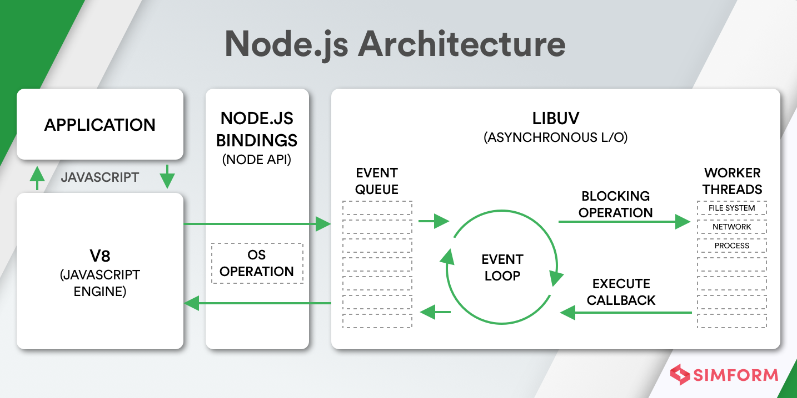

# Node

This repository explains basic Node & NPM concepts.

- [01 Architecture](#01-architecture)
- [02 Differences to Browser JS](#02-differences-to-browser-js)
  - [📄 Task](02_JS_Differences/task.md)
  - [❓ Questions](02_JS_Differences/questions.md)
- [03 NPM](#03-npm)
- [04 Modules](#04-modules)
  - [📄 Task](04_Modules/task.md)
- [05 Express](#05-express)
  - [📚 Codecademy](https://www.codecademy.com/learn/learn-express)
- [06 Todo Fullstack](#06-todo-fullstack)
  - [📄 Task](06_Project/task.md)

## 01 Architecture

In this chapter are the different parts of a basic node architecture explained.

Graphic of how a Node/NPM installation could look like:


### A) What is Node

Node is a Runtime for running JavaScript outside of a browser. It uses the V8 Engine, which is also used in Google Chrome (Chromium), to execute JS Code. It works event-driven which allows non-blocking operations and is a great use for data-intensive applications.



Due to its single thread architecture it is also easily scalable.


### B) What is NPM

NPM is a package manager for managing private or public pieces of code in the Node environment. The packages are kept in the global npm registry ([www.npmjs.com](https://www.npmjs.com/)) or in a private third party registry. Existing packages can be installed in your project via the npm CLI, and new packages can be created and uploaded or linked in your project.

Useful commands:

- `npm init` creates a new NPM project
- `npm install [package]` installs a package
- `npm ci` installs all packages with specific versions listed in the `package-lock.json`

### C) What is NVM

NVM can manage what versions of Node and NPM you want to install. It also allowes switching between versions.

Useful commands:

- `nvm list` shows what versions are installed
- `nvm list available` shows all versions that can be installed
- `nvm install [version]` installs a version
- `nvm use [version]` switches to a version

## 02 Differences to Browser JS

[📄 Task](02_JS_Differences/task.md) &nbsp; | &nbsp; [❓ Questions](02_JS_Differences/questions.md)

### A) Window / Global

Since there is no DOM in the node environment there will also be no `window` object. This means that some objects which are present in the browser are not available in node (eg. window, document, alert, prompt, ...). Furthermore is the outmost this-context different from JS in browser, where it is the window object. In Node the this-context is the `global` object which works a bit like window. This also allowes to have `setTimeout` and `setInterval`, which would otherwise be included in the window object, in Node.

### B) Process

Another object which is exists in the Node environment is `process`. This object keeps information about the process that started that executes the JS code. This information includes for example arguments used when executing a JS file and has methods to stop/exit the process.

- `process.argv` list of arguments used to execute this JS code
- `process.exit()` method to stop the execution

### C) File system access

Unlike browser JS, Node is actually able to access things like the file system. This allows for very useful serverside execution of JS, but will also be a bit more dangerous than regular browser JS. Node provides a built-in support for file system access through the [`fs` package](https://nodejs.org/api/fs.html).

Access to the file system can be done in either a blocking, or non-blocking manner. The `fs` package includes some synchronous methods, although an asynchronous approach is recommanded. Asynchronous methods can either have callbacks, eg. `writeFileAsync`, where a callback function must be provided, or can be used in promise-fashion, eg. `writeFile` from promise part of the package, where you can listen to a promise, or even use the modern async/await standard.

## 03 NPM

### A) Create a NPM project

You can install packages at any time, anywhere. But you will need to keep track of what packages you are using in your code, especially when collaborating with other teammates. When you create a new NPM project using `npm init` you will be prompted some question about that project. After answering, or skiping, those you will be presented with a `package.json` file. This file contains some meta information about the project.

### B) Install a package in a project

Whenever you install a package now you must specify if this package is a standard dependency or only a dev dependency (eg. only used for building the distribution files). You can specify this during installation with the `--save` or `--save-dev` flag.

For example we want to use moment JS in our project and install it like this:

`npm install --save moment`

This will create:

- the `node_modules` folder, if not yet present, with the moment package folder
- the `package-lock.json` file, if not yet present

In the `package.json` there will be a new entry of this package as a dependency.

```json
// package.json

"dependencies": {
    "moment": "^2.29.1"
}
```

While in the `package-lock.json` there are some additional information about the exact version of the package.

```json
// package-lock.json

"node_modules/moment": {
    "version": "2.29.1",
    "resolved": "http://proget.inova.ch/npm/dev/moment/-/moment-2.29.1.tgz",
    "integrity": "sha512-kHmoybcPV8Sqy59DwNDY3Jefr64lK/by/da0ViFcuA4DH0vQg5Q6Ze5VimxkfQNSC+Mls/Kx53s7TjP1RhFEDQ==",
    "license": "MIT",
    "engines": {
        "node": "*"
    }
}
```

### C) Install dependencies from an existing project

To install all dependecies of a project you can use `npm install` without arguments in the project directory. It will install all dependencies specified in the `package.json`. This wil potentially re-generate the `package-lock.json` file with the installed versions. To make sure you have the same version of packages installed as your collaborators when setting up an existing project on your machine, you can use the `npm ci` command, which will install the exact packages listed in the `package-lock.json`. This command is also recommended for build pipelines.

### D) Install packages globally

Sometimes you will need to install a package globally. For example a package that provides a CLI, that should be accessible from anywhere on your machine. You can do so by providing the `-g` flag when installing a dependency.

`npm install -g @angular/cli`

### E) Package selection

On the main registry [www.npmjs.com](https://www.npmjs.com/) are all sorts of packages listed ready for you to use. You can search for a package in the search bar, or get redirected from google to one of the packages detail page. On this page you will see the README.md file from github with instructions on how to use this package, the install command with the package name, plus some meta information. For selecting a package to use in production, it is important to check the weekly downloads and the version cycle/last published version (how often do new versions release). Below is a screenshot of the angular CLI package.


## 04 Modules

[📄 Task](04_Modules/task.md)

For cleaner JS code people tend to move parts of code to their own modules, which then can be imported and used. In Node there are two major types of modules supported.

### A) CommonJS (Node implementation)

CommonJS modules are the original approach of modularization in Node. The module can export code via the `exports` variable in the following way:

```js
// module.js
const foo = 'bar';
module.exports = foo;
```

```js
// client.js
const foo = require('module');
```

### B) ES Modules (native JavaScript)

In the meantime the latest JavaScript versions (EcmaScript) provides a native way to create modules. Especially in TypeScript project this is the preferred way of managing modules. They are used in the following way:

```js
// module.js
export const foo = 'bar';
```

```js
// client.js
import { foo } from 'module';
```

## 05 Express

[📚 Codecademy](https://www.codecademy.com/learn/learn-express)

Express is the basis of Node backends. It creates a webserver and you will be able to define routes and add middleware.

### A) Setup

You can startup a new webserver by creating an `"app"` and listening to a port.

```js
const express = require('express')
const app = express()
const port = 3000;

// define routes and middleware ...

app.listen(port, () => {
  console.log(`Example app listening at http://localhost:${port}`)
});
```

### B) Routing

You can create routes for your app by selecting a method (`GET`, `POST`, `PUT`, `DELETE`, ..), adding the route name (eg. `/home`) and creating a route handler which accepts `Request` and `Response` arguments.

```js
app.get('/home', function (req, res) {
  // define what happens in this route
});
```

### C) Respond

You can respond in a route in various ways. You can send back content like text, html or json. You could also just send a status code.

```js
// send text
res.send('Hello World');

// send HTML
res.send('<h1>Hello World</h1>');

// render a view
// this uses template engine middleware
// https://expressjs.com/en/guide/using-template-engines.html
res.render('home');

// send a status
res.sendStatus(400); // bad request
```

### D) Request

You can also receive data from a request to use on the backend. For example you can get data from route parameters or from the request body.

```js
// get data from route parameters
app.get('/user/:id', function(req, res) {
    // access http://localhost:3000/user/1
    console.log(req.params) // {id: 1}
});

// get data from request body
app.post('/user', function(req, res) {
    console.log(req.body); // {firstname: 'John', lastname: 'Smith'};

    // you might need middleware to receive the request body
    // eg. express.json(), express.urlencoded({extended: true})
});
```

### E) Middleware

To add more functionality to the express application you will use middleware. For example to render views or receive/parse the request body. Such middleware is commonly included using `app.use()` before your route definitions.

```js
app.use(express.json())
app.use(express.urlencoded({extended: true}))
```

More infos on [using](http://expressjs.com/en/guide/using-middleware.html) and [writing](http://expressjs.com/en/guide/writing-middleware.html) middleware in the express docs.

## 06 Todo Fullstack

[📄 Task](06_Project/task.md)

The goal of the project is to create a full stack JavaScript/Node application, where you can manage todo items. You will use existing scaffolding to create:

- Express server as backend
- Angular app as frontend
- Node CLI

## 99 Resources

- https://www.tutorialspoint.com/nodejs/nodejs_event_loop.htm
- https://www.tutorialspoint.com/nodejs/nodejs_global_objects.htm
- https://www.youtube.com/watch?v=ENrzD9HAZK4
- https://v8.dev/
- https://www.npmjs.com/
- https://www.simform.com/blog/what-is-node-js/
- https://nodejs.org/api/fs.html
- https://medium.com/computed-comparisons/commonjs-vs-amd-vs-requirejs-vs-es6-modules-2e814b114a0b
- https://expressjs.com/
- https://developer.okta.com/blog/2019/06/18/command-line-app-with-nodejs